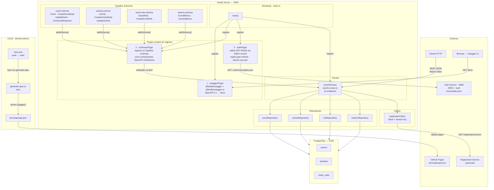
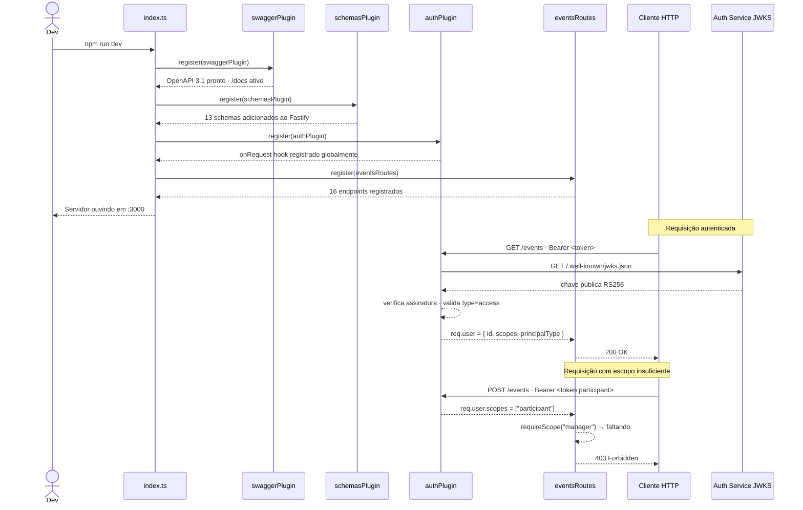
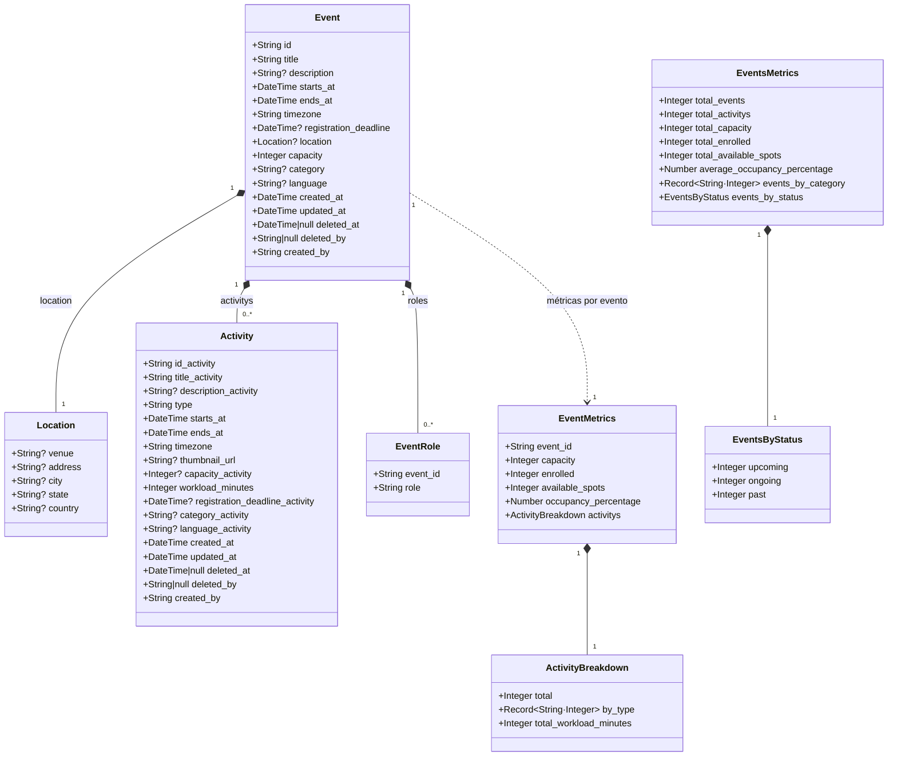
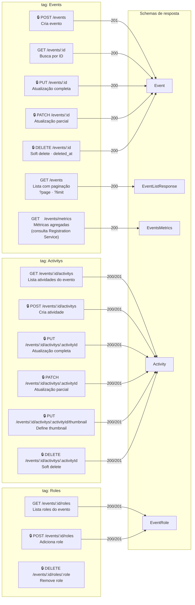
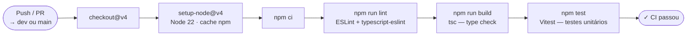
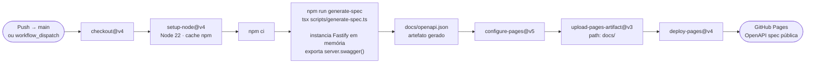

# Events API

API REST para gerenciamento de eventos, atividades e matrículas, construída com **Fastify 5** e **TypeBox**.

## Stack

| Camada | Tecnologia |
|---|---|
| Framework | Fastify 5 |
| Schemas / Validação | @sinclair/typebox 0.34 |
| Documentação | @fastify/swagger + @fastify/swagger-ui |
| Linguagem | TypeScript 5 |
| Testes | Vitest 2 |
| Linting | ESLint + typescript-eslint |
| Runtime dev | tsx |
| Banco de dados | PostgreSQL 16 (Docker) |
| ORM + Migrations | Drizzle ORM + drizzle-kit |
| Validação de env | Zod |
| Autenticação JWT | jose (RS256 via JWKS remoto) |

## Autenticação e Autorização

Todos os endpoints exigem um **JWT de acesso** emitido pelo serviço de autenticação (`0x_t1`).

### Fluxo

1. O cliente obtém um token via `POST /auth/login` no Auth Service.
2. Envia o token no header `Authorization: Bearer <token>`.
3. O `authPlugin` valida a assinatura RS256 buscando a chave pública em `AUTH_SERVICE_URL/.well-known/jwks.json`.
4. Tokens com `type != "access"` (ex: refresh tokens) são rejeitados com `401`.
5. Endpoints protegidos usam `requireScope('manager')` — retorna `403` se o scope estiver ausente.

### Scopes

| Scope | Permissões |
|---|---|
| `participant` | Leitura (GET em todos os endpoints) |
| `manager` | Leitura + escrita (POST, PUT, PATCH, DELETE) |
| `admin` | Inclui todos os scopes anteriores |

### Respostas de erro

| Código | Motivo |
|---|---|
| `401` | Token ausente, inválido, expirado ou `type=refresh` |
| `403` | Token válido mas sem o scope exigido |

---

## Como rodar localmente

### Pré-requisitos

- Node.js 22+
- Docker + Docker Compose
- Auth Service (`0x_t1`) rodando em `http://localhost:8080`

### 1. Instalar dependências

```bash
npm install
```

### 2. Configurar variáveis de ambiente

```bash
cp .env.example .env
```

Edite o `.env` se precisar alterar usuário, senha, porta do banco ou URL dos serviços externos.

| Variável | Descrição | Padrão |
|---|---|---|
| `PORT` | Porta do servidor | `3000` |
| `DATABASE_URL` | Connection string do PostgreSQL | `postgresql://...@localhost:5432/events_db` |
| `AUTH_SERVICE_URL` | URL base do Auth Service (para buscar JWKS) | `http://localhost:8080` |
| `REGISTRATION_SERVICE_URL` | URL base do Registration Service (opcional) | _(vazio — métricas usam 0 como fallback)_ |

### 3. Subir o banco de dados

```bash
npm run db:up
```

Sobe um container PostgreSQL 16 na porta `5432` com volume persistente.

### 4. Aplicar as migrations

```bash
npm run db:migrate
```

Cria as tabelas `events`, `activities` e `event_roles` no banco.

### 5. Subir o Auth Service

O Auth Service (`0x_t1`) deve estar rodando antes de iniciar a API. A partir da raiz do monorepo:

```bash
docker compose -f 0x_t1/docker-compose.yml up -d
```

Usuários de desenvolvimento disponíveis após o seed:

| Email | Senha | Scope |
|---|---|---|
| `admin@local.dev` | `Admin@123` | `participant`, `manager`, `admin` |
| `manager@local.dev` | `Manager@123` | `participant`, `manager` |

### 6. Iniciar o servidor

```bash
npm run dev
```

Servidor disponível em `http://localhost:3000`  
Swagger UI disponível em `http://localhost:3000/docs`

### 7. Rodar os testes

```bash
npm test
```

---

## Scripts

```bash
npm run dev            # servidor com hot-reload
npm run build          # compila TypeScript → dist/
npm run start          # executa build compilado
npm run lint           # verifica qualidade do código com ESLint
npm run test           # roda testes com Vitest
npm run generate-spec  # gera docs/openapi.json

npm run db:up          # sobe o PostgreSQL via Docker Compose
npm run db:down        # para e remove o container
npm run db:generate    # gera arquivos de migration a partir do schema
npm run db:migrate     # aplica migrations no banco
npm run db:studio      # abre o Drizzle Studio (interface visual do banco)
```

A documentação interativa fica disponível em `http://localhost:3000/docs` após iniciar o servidor.

---

## Arquitetura

### Componentes do Sistema



---

### Fluxo de Inicialização e Ciclo de Requisição



---

### Modelo de Dados



---

### Endpoints da API

> Endpoints marcados com 🔒 exigem scope `manager`. Todos os endpoints exigem token válido.



---

### Pipeline CI/CD

**ci.yml** — executa em todo push e PR para `dev` e `main`:



**docs.yml** — executa no merge para `main`:


